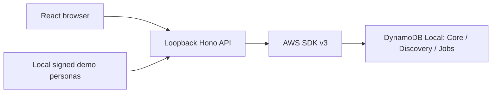
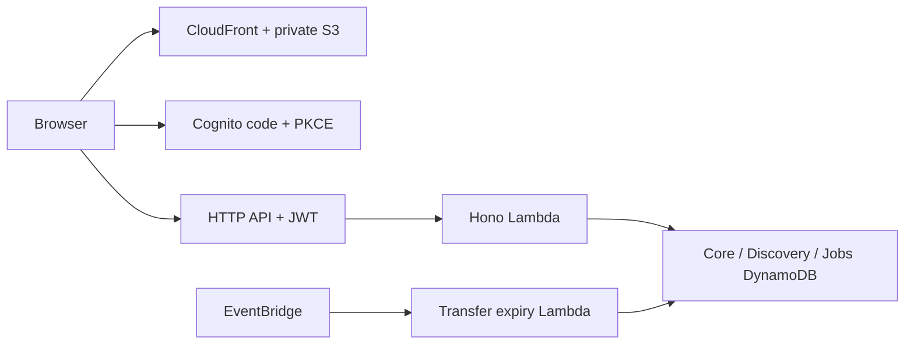

# CampusFix for AWS First Commit

CampusFix makes college service issues traceable from student report to accountable resolution, with private independent reviews and a permission-aware resolution library.

**Working hackathon core:** private drafts, campus/hostel/department visibility, responsible teams, service deadlines, staff queue, replies and private notes, affected status, ownership handover, all fourteen issue commands, reporter-confirmed closure/reopening, independent service reviews and reviewed resolution search.

## Run the IIT Dholakpur demo

**No AWS login required.** Install Node 24 and a Java 17+ JDK, then:

```bash
npm ci
npm run demo
```

Open **http://127.0.0.1:3002**. On Windows use `npm.cmd` if needed. The launcher starts DynamoDB Local, seeds a fictional college and serves the real API and UI. Normal restarts preserve data. Stop it and run `npm run demo:reset` to restore the recording dataset.

- **8 personas:** four students, accountable owner, collaborator, independent reviewer and an outsider from another college.
- **9 reports:** hostel, CSE, Mechanical, Coding club, fees, placement and shared facilities; plus a private draft/review and a reviewed Wi-Fi fix.
- **Real writes:** replies, status changes, ownership, reporter confirmation and history persist in isolated local DynamoDB tables.
- **Visible access rules:** switch personas to compare hostel/department feeds, private staff notes and independent reviews.

Read [DEMO.md](DEMO.md) for prerequisites, people, persistence and reset. Use [DEMO-VIDEO.md](DEMO-VIDEO.md) for the **under-three-minute recording** and [SUBMISSION.md](SUBMISSION.md) for form answers.

### Architecture and AWS status



The local persona selector is excluded from production builds. The AWS deployment design uses genuine Cognito authentication:



**Live AWS deployment is pending account access.** CDK, packaging, deploy/seed/smoke commands and an offline-synthesized template are prepared; follow [AWS-DEPLOY.md](AWS-DEPLOY.md) when access is available. Do not publicly host the local persona server or describe localhost as AWS deployment.

The **complete LLD is not finished**: campus administration/onboarding, notifications and overdue escalation, full review appeals/evidence and community Q&A/activities/marketplace remain. Uploads are tested separately but disabled in this demo and AWS release pending real storage/scanner acceptance. AI/Bedrock is not implemented. No real IIT affiliation or real student data is claimed.

## Read in this order

1. `docs/00-remarks-and-decisions.md` — all three remarks from your Word draft and the resulting decisions.
2. `docs/CampusFix Low Level Design.docx` — the complete readable design.
3. `docs/01-...` through `docs/10-...` — editable, searchable versions for Codex CLI.
4. `specs/openapi.json` — typed API contract; each operation is explicitly marked implemented or pending.
5. `specs/dynamodb-tables.json` and `specs/demo-seed.dynamodb.json` — database setup and synthetic fixtures.
6. `docs/09-build-plan-and-acceptance.md` and `prompts/` — implementation order and ready-to-use coding tasks.

Original requirements and the copy containing your remarks are in `docs/source/`. The original project folder remains separate.

## Production-auth development mode

Use Node 24. On this Windows machine use `npm.cmd` because the PowerShell npm shim is broken.

```powershell
npm.cmd ci
npm.cmd run check
npm.cmd run dev
```

Frontend: http://localhost:5173. API health: http://127.0.0.1:3001/api/health. The public screen and health endpoint need no AWS credentials. Real sign-in requires a configured Cognito pool and public app client; copy `.env.example` to `.env` and supply its public identity settings. Both servers read root `.env`. Stop with Ctrl+C.

Once Docker Desktop is running:

```powershell
docker compose up -d
powershell -ExecutionPolicy Bypass -File scripts/init-local-db.ps1
powershell -ExecutionPolicy Bypass -File scripts/seed-local-db.ps1
```

Local seed identities are fake test references, not Cognito logins. No real campus data or secrets are included. Table initialization never connects to a remote endpoint.

## Begin with Codex CLI

Open this folder in your terminal, start `codex`, and give it the first task:

> Read AGENTS.md and PROGRESS.md, then implement the next unfinished slice from the numbered prompts. Preserve existing work, run the relevant checks and update the progress journal.

Then continue through the prompts in order. The shared contracts let frontend, backend and DB work proceed in parallel after foundation review.

## Contents and status

- `apps/web`: React/Vite identity, reporting, drafts, scoped feed, staff queue resolution/history, evidence, threaded discussions, affected status and ownership handover, private service reviews and reviewed resolution library screens connected to real APIs.
- `apps/api`: Hono local server and Lambda entry; identity, authorization, atomic drafts/publication, workflow commands, version-bound evidence processing and scoped reads.
- `packages/contracts`: shared Zod request/response contracts aligned with implemented OpenAPI operations.
- `infra`: CDK AWS demo stack, scoped IAM and infrastructure/security tests.
- `scripts`: local development, contract checks, AWS packaging/deploy/publish/seed/smoke commands.
- `SETUP-VERIFICATION.md`: exact checks, installed versions and limitations.

See `SETUP-VERIFICATION.md` for exact check counts and cloud acceptance limits. DynamoDB Local integration uses Java because Docker is unavailable; it never points at AWS.

The earlier $50/month number is a planning target, not a verified AWS bill. See chapter 8 for the workload model and deployment inputs.

## Other development database and verification options

If Docker is unavailable, start the official Java distribution in a separate terminal:

```powershell
powershell -ExecutionPolicy Bypass -File scripts/start-local-db.ps1
```

Then initialize and seed with the scripts above and run `npm.cmd run test:integration`.
That legacy development database is synthetic and in memory; recreate it after restarting. The recommended `npm run demo` launcher instead uses its own file-backed database when port 8000 is free. No cloud credentials are used.
Run `npm.cmd run check` for contracts, all type checks, unit/security tests and production builds.
Run `npm.cmd run format` to format application code.

For isolated browser verification with synthetic identities and disposable local tables, run `npm.cmd run test:browser` and open http://127.0.0.1:3002. This is a test rig, not a production login mode.
